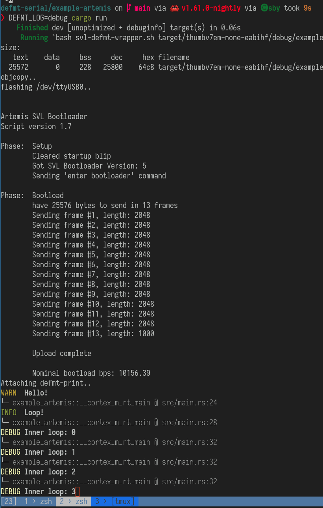

[](https://crates.io/crates/defmt-serial)
[](https://docs.rs/defmt-serial/)

# defmt-serial

A [defmt](https://github.com/knurling-rs/defmt) target for logging over a serial
port. Messages can e.g. be read using `socat` and passed through `defmt-print`,
see [example-artemis](example-artemis) for how to do that. You can also try it
out in a hosted environment: [example-std](example-std).

```rust
#[entry]
fn main() -> ! {
    let mut dp = hal::pac::Peripherals::take().unwrap();
    let pins = hal::gpio::Pins::new(dp.GPIO);

    // set up serial
    let mut serial = hal::uart::Uart0::new(dp.UART0, pins.tx0, pins.rx0);
    defmt_serial::defmt_serial(serial);

    defmt::info!("Hello from defmt!");

    loop {
        asm::wfi();
    }
}
```

Remember to set the `DEFMT_LOG` variable when testing, e.g.:

```
$ cd example-std/
$ DEFMT_LOG=debug cargo run
```

</img>

