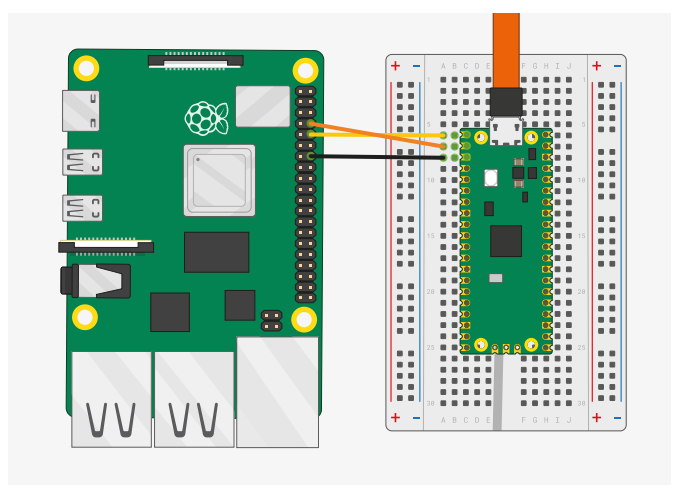
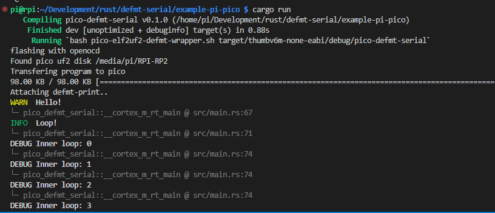

# Pi Pico defmt example

## Introduction
This example shows you how to setup a Pi Pico to output defmt messages over serial. This is useful if you are not using a probe and defmt-rtt. 

## Envrionment Setup
This example relies on using `print-defmt` to decode the output sent over serial. This is a tool rather than a library so add it with
```
cargo install print-defmt
```

Next, check that `pico-elf2uf2-defmt-wrapper.sh` and `pico-elf2uf2-defmt-wrapper.sh` are executable with `chmod +x`.

Finally, ensure that you have permissions to open the serial port without sudo access! 

Often, you need to be part of the dialout group
```
sudo adduser <username> dialout
```

## Raspberry Pi4 to Pico Setup
The following diagram shows how connect a raspberry pi4 to the pico for UART serial connections:

</img>

Source: [Getting Started With Pico](https://datasheets.raspberrypi.com/pico/getting-started-with-pico.pdf) 

## Selecting a runner
If you are not using elf binaries and openocd to flash the pico, open `.cargo/config.toml` and change the selected runner to `pico-elf2uf2-defmt-wrapper.sh`. Otherwise, you can leave the default as is.

## Running and Output
To flash and run this example type:
```
cargo run
```
You should see an output like this:

</img>

## Credits
A lot of the code in this example was derived from the following, execellent tutorials:
1. [https://reltech.substack.com/p/getting-started-with-rust-on-a-raspberry](https://reltech.substack.com/p/getting-started-with-rust-on-a-raspberry)
2. [https://www.fullstacklabs.co/blog/rust-raspberry-pi-pico-blink](https://www.fullstacklabs.co/blog/rust-raspberry-pi-pico-blink)
3. [https://www.alexdwilson.dev/learning-in-public/how-to-program-a-raspberry-pi-pico](https://www.alexdwilson.dev/learning-in-public/how-to-program-a-raspberry-pi-pico)